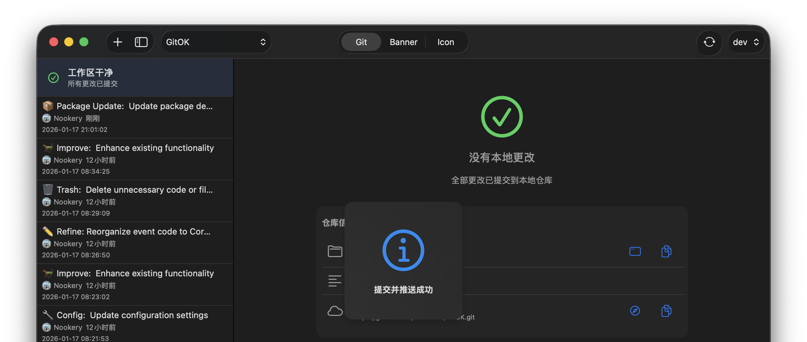

# MagicAlert

[](README.md)

一个基于SwiftUI的iOS和macOS应用通知系统。

## 功能特性

- **通知**: 向用户显示临时消息
- **多种类型**: 成功、错误、警告和信息
- **错误处理**: 内置错误视图组件
- **原生SwiftUI**: 完全使用SwiftUI构建，适用于现代应用

## 截图



## 安装

### Swift Package Manager

将MagicAlert作为依赖项添加到您的`Package.swift`中：

```swift
dependencies: [
    .package(url: "https://github.com/nookery/MagicAlert.git", from: "1.0.0")
]
```

或者直接在Xcode中添加：

1. 转到文件 → 添加包...
2. 输入仓库URL：`https://github.com/nookery/MagicAlert.git`
3. 选择您要使用的版本

## 使用方法

在您的根视图上添加 `.withMagicToast()` 修饰符，然后使用 `MagicMessageProvider.shared` 显示消息：

```swift
import SwiftUI
import MagicAlert

struct ContentView: View {
    var body: some View {
        VStack {
            Button("显示成功消息") {
                MagicMessageProvider.shared.success("操作成功")
            }

            Button("显示错误消息") {
                MagicMessageProvider.shared.error("操作失败")
            }

            Button("显示信息") {
                MagicMessageProvider.shared.info("这是一条信息")
            }

            Button("显示警告") {
                MagicMessageProvider.shared.warning("请注意")
            }

            Button("显示加载中") {
                MagicMessageProvider.shared.loading("正在处理...")
            }
        }
        .withMagicToast() // 启用Toast功能
    }
}
```

## 要求

- iOS 17.0+
- macOS 14.0+
- Swift 5.9+

## 许可证

本项目采用MIT许可证 - 详见LICENSE文件。
