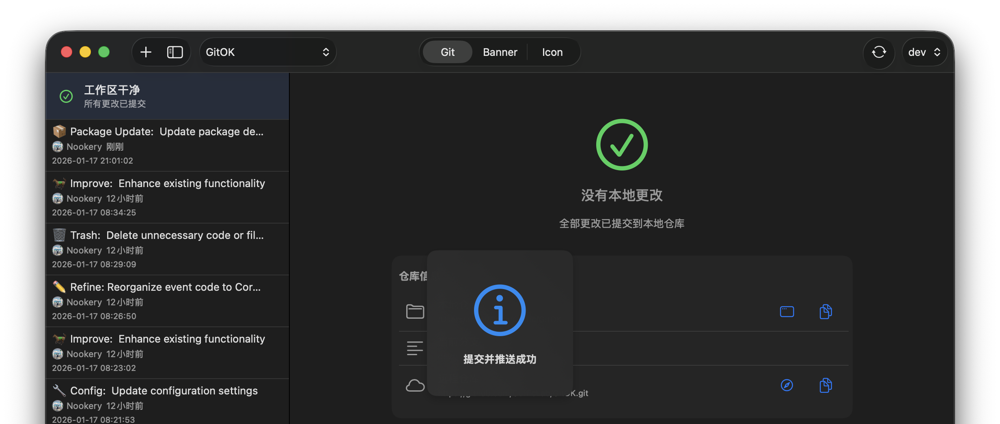

# MagicAlert

[](README.md)

一个基于SwiftUI的iOS和macOS应用通知系统。

## 功能特性

- **通知**: 向用户显示临时消息
- **多种类型**: 成功、错误、警告和信息
- **错误处理**: 内置错误视图组件
- **原生SwiftUI**: 完全使用SwiftUI构建，适用于现代应用

## 截图



## 安装

### Swift Package Manager

将MagicAlert作为依赖项添加到您的`Package.swift`中：

```swift
dependencies: [
    .package(url: "https://github.com/nookery/MagicAlert.git", from: "1.0.0")
]
```

或者直接在Xcode中添加：

1. 转到文件 → 添加包...
2. 输入仓库URL：`https://github.com/nookery/MagicAlert.git`
3. 选择您要使用的版本

## 使用方法

在您的根视图上添加 `.withMagicToast()` 修饰符，然后使用全局函数显示消息：

```swift
import SwiftUI
import MagicAlert

struct ContentView: View {
    var body: some View {
        VStack {
            Button("显示成功消息") {
                alert_success("操作成功")
            }

            Button("显示错误消息") {
                alert_error("操作失败", autoDismiss: false)
            }

            Button("显示信息") {
                alert_info("这是一条信息", subtitle: "详细描述")
            }

            Button("显示警告") {
                alert_warning("请注意")
            }

            Button("显示加载中") {
                alert_loading("正在处理...")
            }

            Button("隐藏加载") {
                alert_dismiss_loading()
            }

            Button("隐藏所有") {
                alert_dismiss_all()
            }
        }
        .withMagicToast() // 启用Toast功能
    }
}
```

**可用的全局函数：**

- `alert_info(_ title: String, subtitle: String? = nil, duration: TimeInterval = 3.0)` - 显示信息提示
- `alert_success(_ title: String, subtitle: String? = nil, duration: TimeInterval = 3.0)` - 显示成功提示
- `alert_warning(_ title: String, subtitle: String? = nil, duration: TimeInterval = 4.0)` - 显示警告提示
- `alert_error(_ title: String, subtitle: String? = nil, duration: TimeInterval = 0, autoDismiss: Bool = false)` - 显示错误文本
- `alert_error(_ error: Error, title: String? = nil, duration: TimeInterval = 0, autoDismiss: Bool = false)` - 显示错误对象
- `alert_loading(_ title: String, subtitle: String? = nil)` - 显示加载中提示
- `alert_dismiss_loading()` - 隐藏加载中提示
- `alert_dismiss_all()` - 隐藏所有提示

## 要求

- iOS 17.0+
- macOS 14.0+
- Swift 5.9+

## 许可证

本项目采用MIT许可证 - 详见LICENSE文件。
